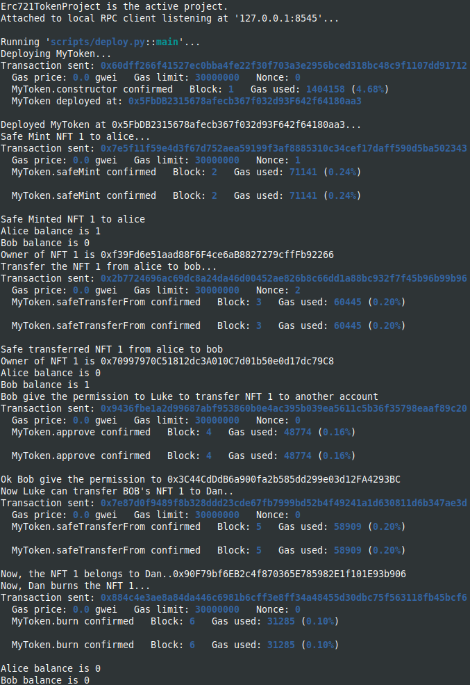

Study case of an ERC721 token contract, OpenZeppelin site [OpenZeppelin, ERC721](https://docs.openzeppelin.com/contracts/4.x/erc721/)

I used brownie with hardhat in order to deploy and use the console.log features.
You should start the hardhat node in another terminal and folder (`hh node`), then, in a terminal :

```
brownie compile
brownie run scripts/deploy.py
```

Demonstrates the use of the ERC721 Burnable NFT contract.
Minting, transferring, approving, burning NFT.

Deployment from brownie:

